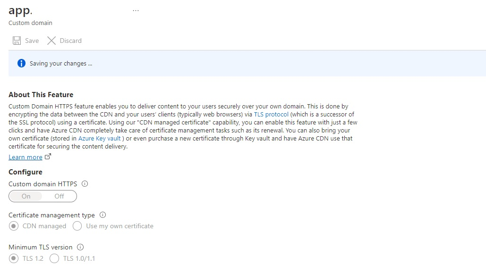
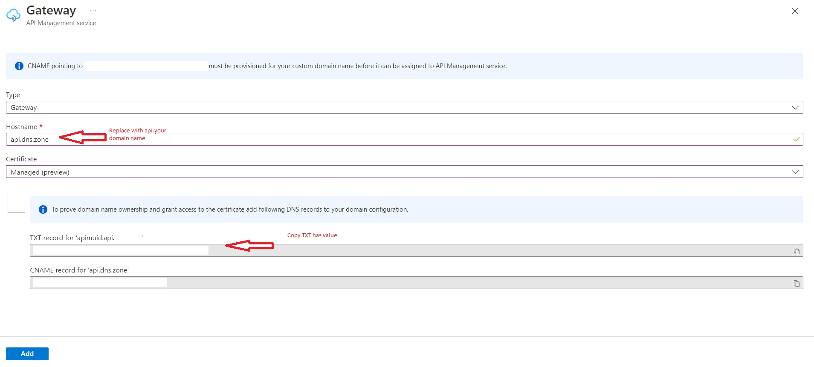

# serverless-webapp-kotlin

Use Azure Serverless stack to build a full-fledged web application with both backend and frontend hosted inside a same mono repo.

CI/CD pipeline is implemented using [GitHub actions](.github/workflows) for both backend and frontend app including related serverless cloud infrastructure for  backend and frontend. Infrastructure as code(IAC) for both frontend and backend infra is written using [Bicep](https://learn.microsoft.com/en-us/azure/azure-resource-manager/bicep/overview)

Application builds a React static web app, which talks to a bunch of APIs hosted via [Azure API Management](https://azure.microsoft.com/en-us/products/api-management/) and talking to azure functions written in kotlin, Azure storage and Azure Cosmo DB and Azure Cognitive services as backends. Feature of web application itself is simple. Since that is not the main purpose here. User can basically upload an image with a metadata. Then if user want, they can try uploading another image from another flow, and try to find face in it. If it's found in Cosmo DB, then we return the metadata.

# Architecture diagram for the application

TODO

# Pre requisite

Either install tools listed below or use Github codespaces. 

- [Azure CLI](https://learn.microsoft.com/en-us/cli/azure/install-azure-cli)
- [Java 11](https://learn.microsoft.com/en-us/java/openjdk/install)


# Initialization

Given [pre requisite](#pre-requisite) are already configured, lets get started to initialize local environment.

1. Set environment variables.

    ```bash
    AZURE_TENANT=<<tenant-id>>
    SUBSCRIPTION_ID=<<subscription-id>>

    AZURE_REGION=<<region>>
    RESOURCE_GROUP=<<new resource group name>>

    # Required if custom domain needs to be configured for the app, else set as empty
    DNS_ZONE=<<custom domain that you own>>
    ```

2. Login into azure

    ```bash
    # Complete login on the browser window which opens up after below command
    az login --tenant $AZURE_TENANT
    az account set --subscription $SUBSCRIPTION_ID

    # Set default resource group and region. If you don't want to set default, make sure to pass this in relevant commands later.
    az config set defaults.location=$AZURE_REGION defaults.group=$RESOURCE_GROUP
    ```

# Deploy core infrastructure resources

In core infra setup, resources which are common to both frontend and backend are deployed. Primarily this is used to create a resource group where both frontend and backend resources will be created. If you plan to configure custom domain name for the app, Azure DNS zone can also be created.

```bash
az deployment sub create -f core/bicep/main.bicep -n core-infra -p resourceGroup=$RESOURCE_GROUP location=$AZURE_REGION dnsZoneName=$DNS_ZONE
```

If DNS Zone is specified for custom domain, update your DNS registrar with created DNS zone name server info. You can get name server info by running below command.

```bash
az network dns zone show --name $DNS_ZONE -o jsonc
```

# Deploy frontend infrastructure and application

1. Before deploying frontend infrastructure, make sure the subscription is enabled for `Microsoft.Cdn` namespace.

    ```bash
    az provider register --namespace Microsoft.Cdn
    ```
2. Deploy frontend infrastructure which includes storage account for static website hosting and Azure CDN. Depending on if you specify DNS zone as well, it will attempt to configure custom domain with the CDN as wel with CDN managed certificate. By default, IAC will configure custom domain with `app.$DNS_ZONE`

    ```bash
    az deployment group create -f frontend/bicep/main.bicep --name app-frontend -p dnsZoneName=$DNS_ZONE

    FRONTEND_STORAGE=$(az deployment group show --name app-frontend --output tsv --query 'properties.outputs.storageAccountNameForFrontEndArtifacts.value')

    FRONTEND_URL=$(az deployment group show --name app-frontend --output tsv --query 'properties.outputs.cdnEndpointHostName.value')

    echo $FRONTEND_STORAGE
    echo $FRONTEND_URL
    ````

    Next, Go to the azure portal and navigate to Azure CDN endpoint created. Under custom domain, **enable custom https** and use cdn managed.

    

3. Deploy frontend application

    ```bash
    cd frontend
    npm ci --legacy-peer-deps
    npm run build --if-present
    
    az storage blob upload-batch --account-name $FRONTEND_STORAGE --auth-mode key -d '$web' -s build/. --overwrite

    cd ..
    ```
    At this point the frontend site should be up and running. Navigate to the `FRONTEND_URL`. If in case, It's still not up, probably CDN purge is required. Execute below command to purge the CDN profile.

    ```bash
    az cdn endpoint purge --content-paths / --ids $(az cdn endpoint list --profile-name $(az cdn profile list -o tsv --query [0].name) -o tsv --query [0].id)
    ```
    
# Deploy backend infrastructure and application

Now that the frontend application should be up and running, let get started to deploy the backend infrastructure and application. Backend infrastructure exposes REST apis using Azure API management backed by azure functions. It also uses storage account blob containers to store images and Azure cosmo DB for metadata etc. Azure Cognitive service face api is used to perform recognition.

1. Deploy backend infrastructure.

    ```bash
    az deployment group create -f backend/bicep/main.bicep --name app-backend -p originHostForFrontend=$FRONTEND_URL createApim=true dnsName=$DNS_ZONE
    ```
2. !!OPTIONAL!! Configure custom domain with [APIM Managed Certificate](https://azure.microsoft.com/en-us/updates/public-preview-managed-certificate-support-for-azure-api-management/), which is still in public preview. This step is required only if you are using custom domain as well to configure the app. By default, IAC will configure custom domain with `api.$DNS_ZONE`. Because free managed cert for APIM is still in preview, we need to do perform some steps manually in console.

    Firstly, Navigate to azure portal --> resource group --> configured resource group --> APIM --> Select deployed APIM instance --> go to custom domain. Refer screenshot below. Copy the TXT record has value. Hostname value should be `api.$DNS_ZONE`. So if you domain name is `contosohotels.com` then put `api.contosohotels.com`. Click Add but **Do not click** save yet. We first need to configure dns records in the dns zone.

    Next, once you have TXT record hash copied, run below command:

    ```bash
    APIM=$(az deployment group show --name app-backend --output tsv --query 'properties.outputs.apiManagementName.value')

    echo $APIM

    az deployment group create  -f backend/bicep/apimManagedCert.bicep  --name app-backend-apim-cert -p dnsZoneName=$DNS_ZONE apimName=$APIM txtHash=<<Hash fetched from portal>>
    ```

   Now head back to the azure portal and **click Save** to complete custom domain initialization and for APIM to configure and issue free managed cert.

   **Note:** When configuring custom domain with APIM Managed cert, make sure to run subsequent deployment of backend infra with parameter `createApim=false`. Since managed cert is still in preview, part of the process has to be enabled manually from console rite now and running creation via ARM replaces manual configuration in APIM.  

3. Deploy the backend application written in kotlin via maven azure function plugin.

    ```bash
    FN_APP_NAME=$(az deployment group show --name app-backend --output tsv --query 'properties.outputs.functionAppName.value')

    echo $FN_APP_NAME
    mvn clean install -f backend/FaceApp/pom.xml -DappName=$FN_APP_NAME

    mvn azure-functions:deploy -f backend/FaceApp/pom.xml -DresourceGroup=$RESOURCE_GROUP -DappName=$FN_APP_NAME
    ````
4. Now that we have all the azure functions deployed, we need to configure event subscription for when any image is created in the image storage blob container it triggers an azure function to process that image.

    ```bash
    IMAGE_STORAGE=$(az deployment group show --name app-backend --output tsv --query 'properties.outputs.imageStorageAccountName.value')

    echo $IMAGE_STORAGE

    az deployment group create -f backend/bicep/eventSubscription.bicep  --name app-backend-event-subscription -p storageAccountName=$IMAGE_STORAGE functionApp=$FN_APP_NAME devSubscriptionUrl=''
    ```
5. Fetch API related details to update it in the frontend application.

    ```bash
    FIND_IMAGE_URL=$(az deployment group show --name app-backend --output tsv --query 'properties.outputs.findPersonUrl.value')

    UPLOAD_URL=$(az deployment group show --name app-backend --output tsv --query 'properties.outputs.uploadURl.value')

    APIMID=$(az apim show -n $APIM --query id -o tsv)

    CODE=$(az rest --method post  --uri ${APIMID}/subscriptions/face-app-frontend/listSecrets?api-version=2021-08-01 --query primaryKey -o tsv)

    echo $FIND_IMAGE_URL
    echo $UPLOAD_URL
    echo $CODE
    ```

6. Deploy the frontend app again with the update url of the backend APIs. Edit the file [GlobalConstants.ts](frontend/src/GlobalConstants.ts) and update properties `UPLOAD_URL` and `FIND_IMAGE` in the constants along with `code` query param.

    ```bash
    cd frontend
    npm run build --if-present
      
    az storage blob upload-batch --account-name $FRONTEND_STORAGE --auth-mode key -d '$web' -s build/. --overwrite

    cd ..

    az cdn endpoint purge --content-paths / --ids $(az cdn endpoint list --profile-name $(az cdn profile list -o tsv --query [0].name) -o tsv --query [0].id)

    echo $FRONTEND_URL
    ```

CONGRATULATIONS!! The application should be up and running with both frontend and backend functional.

# Deployment using CI and CD

Application uses GitHub actions for deploying both infrastructure and application resources. All workflows can be found in [.github](.github/workflows/) folder.

Git actions uses [Azure login action with OpenID Connect](https://learn.microsoft.com/en-us/azure/developer/github/connect-from-azure?tabs=azure-portal%2Clinux#use-the-azure-login-action-with-openid-connect) to authenticate with azure. 

### Setup app for OpenId Connect Auth

```bash
TODO
```

Below are different workflows:

1. Deploy frontend application
2. Deploy backend application i.e. azure function app
3. Core infrastructure
4. Frontend infrastructure
5. Backend infrastructure

## Run applications locally

If you want to test azure functions locally, it's possible to do so. Functions are dependent on some cloud resources like CosmoDB, storage accounts etc. to function locally.

1. Because functions are dependent on cloud resources, appropriate role assignments needs to be done for local logged inn cli user to the resources.

    ```bash
    LOCAL_USER_ID=$(az ad signed-in-user show -o tsv --query id)

    az role assignment create --role 'Storage Queue Data Contributor' --assignee-object-id $LOCAL_USER_ID
    
    az role assignment create --role 'Storage Blob Data Owner' --assignee-object-id $LOCAL_USER_ID 
    
    az role assignment create --role 'Storage Account Contributor' --assignee-object-id $LOCAL_USER_ID

    KV_NAME=$(az deployment group show --name app-backend --output tsv --query 'properties.outputs.kvName.value')

    DB_ACC_NAME=$(az deployment group show --name app-backend --output tsv --query 'properties.outputs.dbAccountName.value')

    az keyvault set-policy --secret-permissions all --name $KV_NAME --object-id $LOCAL_USER_ID

    CUSTOM_ROLE_ID=$(az cosmosdb sql role definition list -a $DB_ACC_NAME -o tsv --query "[?typePropertiesType == 'CustomRole']|[0].id")

    az cosmosdb sql role assignment create -p $LOCAL_USER_ID -d $CUSTOM_ROLE_ID -a $DB_ACC_NAME -s $DB_ACC_NAME
    ```
2. Fetch the function app settings locally.

    ```bash
    cd backend/faceApp

    func azure functionapp fetch-app-settings $FN_APP_NAME --output-file local.settings.json
    
    mvn clean install -DappName=$FN_APP_NAME

    mvn azure-functions:run -DresourceGroup=$RESOURCE_GROUP -DappName=$FN_APP_NAME
    ```
3. Setup ngrok to create event subscription for when any image is created in the image storage blob container it triggers function locally to process that image.

    Follow this [Run ngrok](https://learn.microsoft.com/en-us/azure/azure-functions/functions-event-grid-blob-trigger?pivots=programming-language-java#run-ngrok) guide. Copy the HTTPS URL generated when ngrok is run. This value is used to determine the webhook endpoint on your computer exposed using ngrok.

    ```bash
    IMAGE_STORAGE=$(az deployment group show --name app-backend --output tsv --query 'properties.outputs.imageStorageAccountName.value')

    echo $IMAGE_STORAGE

    az deployment group create -f backend/bicep/eventSubscription.bicep --name app-backend-event-subscription -p storageAccountName=$IMAGE_STORAGE functionApp='' devSubscriptionUrl=<<replace with ngrok generated https url>>
    ```

4. If needed to test end to end using frontend application as well, get the frontend app up and running as well in a separate terminal window. Open [GlobalConstants.ts](frontend/src/GlobalConstants.ts) and update properties `UPLOAD_URL` and `FIND_IMAGE` to ``localhost` urls

    ```bash
    cd frontend
    npm run start 
    ```

# Security
See [CONTRIBUTING](CONTRIBUTING.md) for more information.

# License

This library is licensed under the MIT-0 License. See the [LICENSE](LICENSE.md) file.

